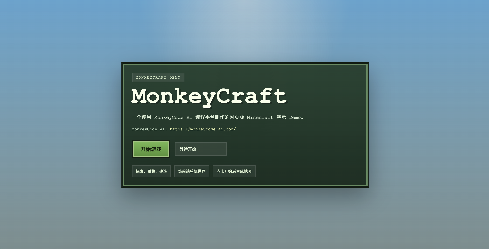
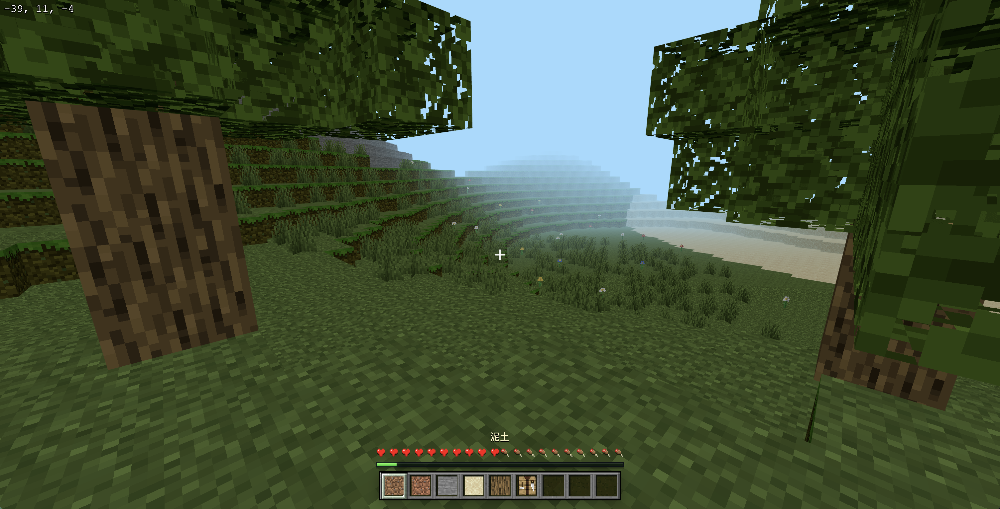

# MonkeyCraft

MonkeyCraft 是一个网页版 Minecraft 风格演示项目，核心玩法聚焦在探索、采集与建造。

这个项目同时也是 **MonkeyCode AI** 编程平台的能力展示样例，用来说明 AI 辅助编程平台如何帮助团队更快地完成从想法到可交互 Demo 的落地。

- MonkeyCode AI 官网：[https://monkeycode-ai.com/](https://monkeycode-ai.com/)
- 平台定位：面向产品原型、交互 Demo、前端项目和快速迭代开发的 AI 编程平台
- 在线试玩地址：[https://safe1ine.github.io/MonkeyCraft/](https://safe1ine.github.io/MonkeyCraft/)

## 项目背景

MonkeyCraft 并不是一个静态展示页，而是一个可以直接进入、生成地图并开始游玩的浏览器 Demo。  
这个项目想表达的是：借助 MonkeyCode AI，可以更高效地完成下面这类工作：

- 快速搭建可玩的网页原型
- 持续迭代 UI、交互和视觉表现
- 结合反馈不断修改玩法和世界生成逻辑
- 用纯前端方式交付可直接试玩的体验

## 为什么做这个项目

我们希望用 MonkeyCraft 说明，MonkeyCode AI 并不只适合写普通业务页面，也适合下面这些更具表现力的项目：

- 网页游戏原型
- 3D/体素类交互体验
- 带完整 HUD 和操作逻辑的演示项目
- 需要持续打磨细节的前端产品实验

如果你想了解这个 Demo 背后的平台，可以访问：

[https://monkeycode-ai.com/](https://monkeycode-ai.com/)

## 当前能力

当前版本已经具备这些内容：

- 浏览器第一人称视角
- 每次开始生成新的随机世界
- 地形包含高山、洞穴、草地、树木、花和草丛
- 世界中包含橡树和桦树
- 支持挖掘和放置方块
- 支持背包与基础合成界面
- 带有 Minecraft 风格的 HUD 和热栏
- 单机纯前端运行，无需后端服务

## 项目截图





## 本地运行

```bash
npm run serve
```

或者：

```bash
python3 -m http.server 8000
```

然后在浏览器打开：

```text
http://localhost:8000
```

## 说明

- 这是一个演示性质的项目，不是完整 Minecraft 复刻。
- 这个项目的重点是展示 MonkeyCode AI 在构建网页版 Minecraft 风格 Demo 时的效率和可迭代性。
